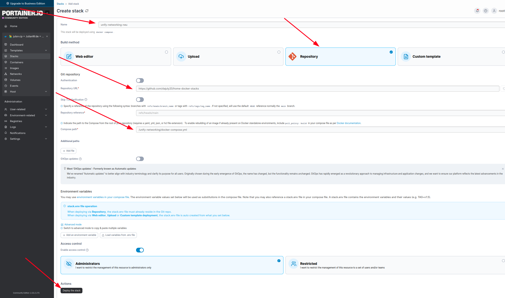

# 🐳 Home Docker Stacks

Dieses Repository enthält die produktiven und experimentellen **Docker-Stacks** meiner Home-Infrastruktur.  
Alle Deployments erfolgen über **Portainer** (zentrale Verwaltung via [`portainer.julianw.ip`](https://portainer.julianw.ip)).

---

## 📁 Struktur

| Ordner | Beschreibung |
|---------|---------------|
| `authentik/` | Authentik-Stack inkl. Compose-Datei und Backup-Ordner (`.bak.*`) |
| `grafana/` | Grafana Monitoring & Visualisierung mit Prometheus Integration |
| `home-assistant/` | Home Assistant mit MQTT, Zigbee2MQTT, Supervisor-Integration |
| `portainer/` | Portainer Management-Stack |
| `unify-networking/` | UniFi Network Application (Controller, Backup-Scheduler, etc.) |
| `authentik/inspect/` | Debug- und Diagnose-Dumps ohne Secrets |

---

## 🧩 Deployment via Portainer

Alle Stacks werden über **Portainer CE** bereitgestellt.  
Unter *Stacks → Add Stack → Repository* kann das Git-Repo direkt eingebunden werden.



### Beispielkonfiguration
| Feld | Wert |
|------|------|
| **Name** | `unify-networking-neu` |
| **Repository URL** | `https://github.com/dajuly20/home-docker-stacks` |
| **Repository reference** | `refs/heads/main` |
| **Compose path** | `/unify-networking/docker-compose.yml` |
| **Authentication** | via GitHub Token (`repo`-Scope) |
| **Deploy method** | *Docker Compose* |

> 💡 Hinweis: Cortana (`https://portainer.julianw.ip`) dient als primärer Portainer-Endpoint  
> und führt Auto-Pulls über einen GitHub-Token mit `repo`-Rechten aus.

---

## 🚀 Schnellstart (lokal)

```bash
git clone https://github.com/dajuly20/home-docker-stacks.git
cd home-docker-stacks/unify-networking
docker compose up -d

# 🐳 Home Docker Stacks

Dieses Repository enthält die produktiven und experimentellen **Docker-Stacks** meiner Home-Infrastruktur.  
Alle Deployments erfolgen über **Portainer** (zentrale Verwaltung via [`cortana.julianw.ip`](https://cortana.julianw.ip)).
 ```

---

## 🧭 Nächste Schritte

| Bereich | Aufgabe | Status |
|----------|----------|--------|
| **GitOps & Automation** | GitHub Webhook für automatisches Redeploy bei Push einrichten | ⏳ |
| **Portainer Integration** | Deploy Logs zentral in Container loggen (`git rev-parse HEAD`) | ⏳ |
| **Security** | Personal Access Token (repo-scope) für Auto-Pulls absichern | ✅ |
| **Backup** | Nightly-Backup-Job auf `cortana.julianw.ip` einplanen (`cron + restic`) | ⏳ |
| **Monitoring** | Healthchecks pro Stack aktivieren und in Uptime Kuma integrieren | ⏳ |
| **Docs** | Markdown-Docs je Stack (`authentik.md`, `unifi.md`, `ha.md`) ergänzen | 📝 |
| **Enhancement** | Makefile für lokale Test-Deployments erstellen | 💡 |
| **Long-Term** | Migration auf Docker Swarm / Nomad prüfen | 🔮 |****